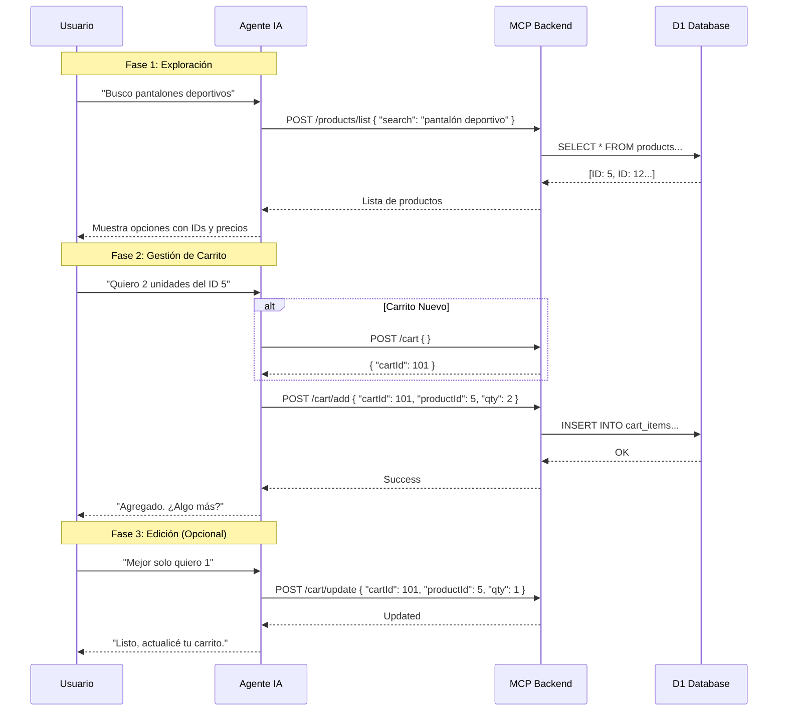

# Laburen Challenge - AI Sales Agent (MCP + D1)

## 🎯 Objetivo del Challenge
El objetivo de este proyecto es demostrar el **diseño e implementación de un agente de ventas conversacional** integrado mediante el **Model Context Protocol (MCP)**.
Se priorizó una arquitectura desacoplada y productiva, construyendo un backend propio (API REST) con persistencia de estado real, capaz de manejar flujos de negocio complejos (búsqueda, carrito, stock) de forma autónoma.

---

## 📱 Canal WhatsApp (Alcance y Limitaciones)
El agente ha sido diseñado y arquitecturado para operar nativamente sobre **WhatsApp**.

*   **Integración Ideal**: WhatsApp -> Twilio -> Chatwoot -> Laburen Agent -> MCP Backend.
*   **Estado Actual (Demo)**: Debido a los costos operativos de integración (Twilio) y tiempos de aprobación, la demostración funcional se realiza a través del **Web Standalone** de Laburen.
*   **Documentación**: La guía completa para activar el canal de WhatsApp en un entorno de producción real se encuentra detallada en [`docs/deployment_guide.md`](./docs/deployment_guide.md).

---

## 📐 Fase Conceptual · Diseño del Agente de IA

Esta sección describe la lógica de interacción diseñada para que el agente maneje ventas de manera autónoma.

### 1. Diagrama de Flujo de Interacción
El siguiente diagrama ilustra cómo el agente orquesta las herramientas (MCP) para satisfacer la intención del usuario, desde la exploración hasta la gestión del carrito.



### 2. Definición de Endpoints (MCP)
Estas son las **Actions** que el agente tiene disponibles para interactuar con el sistema.
> **Nota Importante**: El MCP nunca devuelve texto orientado al usuario final. Todas las respuestas son JSON estructurados para consumo exclusivo y razonamiento del agente.

| Endpoint | Método | Descripción | Body Esperado (JSON) |
|----------|--------|-------------|----------------------|
| `/products/list` | POST | Busca productos en el catálogo. | `{ "search": "keyword" }` |
| `/cart` | POST | Inicializa una nueva sesión de compra. | `{}` |
| `/cart/add` | POST | Agrega ítems al carrito activo. | `{ "cartId": 1, "productId": 5, "qty": 2 }` |
| `/cart/get` | POST | Obtiene el estado actual del carrito y total. | `{ "cartId": 1 }` |
| `/cart/update` | POST | Modifica cantidad o elimina (si qty=0). | `{ "cartId": 1, "productId": 5, "qty": 1 }` |

---

## 🚀 Arquitectura

*   **Runtime**: Cloudflare Workers (Serverless) - *Baja latencia y escalabilidad instantánea.*
*   **Base de Datos**: Cloudflare D1 (SQLite distribuido) - *Persistencia ligera y rápida en el borde.*
*   **API Design**: "Agent-First" (JSON/POST only) - *Optimizado para LLM Function Calling.*
*   **Lenguaje**: TypeScript - *Seguridad de tipos y mantenibilidad.*

## 📂 Estructura del Proyecto

```
/src
  /controllers  -> Lógica de negocio pura (SQL queries, validaciones), sin conocimiento del agente.
  /routes       -> Capa de contrato MCP (adaptadores HTTP para las Tools).
  index.ts      -> Entry point y Router principal.
/docs
  design.md          -> Diagramas de flujo y especificación técnica detallada.
  agent_config.md    -> System Prompt y JSON Schemas listos para copiar a Laburen.
  deployment_guide.md -> Guía paso a paso para integración (Twilio, Chatwoot, Deploy).
/scripts
  convert_xlsx_to_sql.js -> Utilidad ETL para importar productos desde Excel.
```

## 🛠️ Instalación y Uso Local

1.  **Instalar dependencias**:
    ```bash
    npm install
    ```
2.  **Iniciar servidor local**:
    ```bash
    npm run dev
    ```
    El API estará disponible en `http://localhost:8787`.

3.  **Probar Endpoints**:
    Ver ejemplos de JSON en `docs/design.md`.

## ☁️ Despliegue a Producción

1.  **Login en Cloudflare**:
    ```bash
    npx wrangler login
    ```
2.  **Inicializar Base de Datos (Solo primera vez)**:
    ```bash
    npx wrangler d1 execute shop_db --remote --file=./schema.sql
    npx wrangler d1 execute shop_db --remote --file=./seed_products.sql
    ```
3.  **Desplegar Worker**:
    ```bash
    npm run deploy
    ```

## 🤖 Configuración del Agente

Para conectar este backend con la inteligencia artificial:
1.  Copia la URL de tu worker desplegado.
2.  Usa los **JSON Schemas** definidos en `docs/agent_config.md` para configurar las Tools en Laburen.
3.  Pega el **System Prompt** sugerido en la configuración del modelo.

---
Hecho con ⚡️ y TypeScript.
