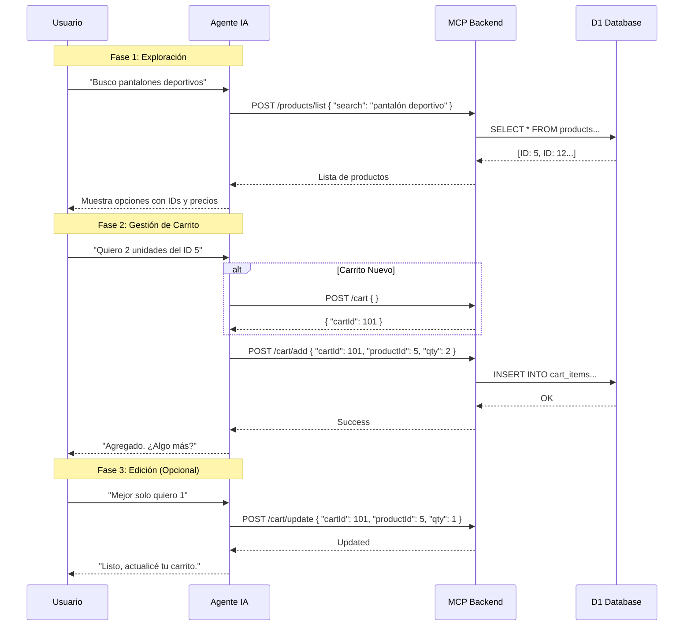

# Laburen Challenge - AI Sales Agent (MCP + D1)

Solución completa para el desafío técnico de **AI Engineer**. Este repositorio contiene el backend (Model Context Protocol) que potencia a un agente de ventas capaz de buscar productos y gestionar carritos de compra vía WhatsApp.

## 📐 Fase Conceptual · Diseño del Agente de IA

Esta sección describe la lógica de interacción diseñada para que el agente maneje ventas de manera autónoma.

### 1. Diagrama de Flujo de Interacción
El siguiente diagrama ilustra cómo el agente orquesta las herramientas (MCP) para satisfacer la intención del usuario, desde la exploración hasta la gestión del carrito.



### 2. Definición de Endpoints (MCP)
Estas son las **Actions** que el agente tiene disponibles para interactuar con el sistema.

| Endpoint | Método | Descripción | Body Esperado (JSON) |
|----------|--------|-------------|----------------------|
| `/products/list` | POST | Busca productos en el catálogo. | `{ "search": "keyword" }` |
| `/cart` | POST | Inicializa una nueva sesión de compra. | `{}` |
| `/cart/add` | POST | Agrega ítems al carrito activo. | `{ "cartId": 1, "productId": 5, "qty": 2 }` |
| `/cart/get` | POST | Obtiene el estado actual del carrito y total. | `{ "cartId": 1 }` |
| `/cart/update` | POST | Modifica cantidad o elimina (si qty=0). | `{ "cartId": 1, "productId": 5, "qty": 1 }` |

---

## 🚀 Arquitectura

*   **Runtime**: Cloudflare Workers (Serverless).
*   **Base de Datos**: Cloudflare D1 (SQLite distribuido).
*   **API Design**: "Agent-First" (JSON/POST only) para fácil integración con LLMs.
*   **Lenguaje**: TypeScript.

## 📂 Estructura del Proyecto

```
/src
  /controllers  -> Lógica de negocio (SQL queries, validaciones)
  /routes       -> Definición de endpoints (POST /cart/add, etc.)
  index.ts      -> Entry point y Router principal
/docs
  design.md          -> Diagramas de flujo y especificación técnica.
  agent_config.md    -> System Prompt y JSON Schemas para la plataforma Laburen.
  deployment_guide.md -> Guía paso a paso para Twilio y Chatwoot.
/scripts
  convert_xlsx_to_sql.js -> Utilidad para importar productos desde Excel.
```

## 🛠️ Instalación y Uso Local

1.  **Instalar dependencias**:
    ```bash
    npm install
    ```
2.  **Iniciar servidor local**:
    ```bash
    npm run dev
    ```
    El API estará disponible en `http://localhost:8787`.

3.  **Probar Endpoints**:
    Ver ejemplos de JSON en `docs/design.md`.

## ☁️ Despliegue a Producción

1.  **Login en Cloudflare**:
    ```bash
    npx wrangler login
    ```
2.  **Inicializar Base de Datos (Solo primera vez)**:
    ```bash
    npx wrangler d1 execute shop_db --remote --file=./schema.sql
    npx wrangler d1 execute shop_db --remote --file=./seed_products.sql
    ```
3.  **Desplegar Worker**:
    ```bash
    npm run deploy
    ```

## 🤖 Configuración del Agente

Para conectar este backend con la inteligencia artificial:
1.  Copia la URL de tu worker desplegado.
2.  Usa los **JSON Schemas** definidos en `docs/agent_config.md` para configurar las Tools en Laburen.
3.  Pega el **System Prompt** sugerido en la configuración del modelo.

---


