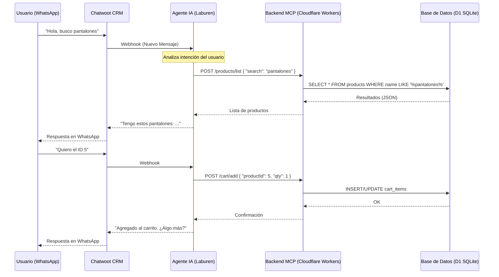

# Diseño Conceptual del Agente de Ventas

## 1. Diagrama de Flujo de Interacción

El siguiente diagrama ilustra cómo fluye la información desde que el usuario envía un mensaje por WhatsApp hasta que recibe una respuesta del Agente con datos reales.

## 2. Definición de Endpoints (MCP)

El Model Context Protocol (MCP) expone una API RESTful optimizada para Agentes (JSON-First, solo POST).

### A. Productos
| Endpoint | Método | Descripción | Body Esperado |
|----------|--------|-------------|---------------|
| `/products/list` | POST | Busca productos por nombre/descripción. | `{ "search": "string" }` |
| `/products/get` | POST | Obtiene detalle de un producto. | `{ "productId": "string" }` |

### B. Carrito de Compras
| Endpoint | Método | Descripción | Body Esperado |
|----------|--------|-------------|---------------|
| `/cart` | POST | Crea un nuevo carrito vacío. | `{}` |
| `/cart/add` | POST | Agrega ítems o suma cantidad. | `{ "cartId": number, "productId": number, "qty": number }` |
| `/cart/update` | POST | Edita cantidad exacta o elimina (qty=0). | `{ "cartId": number, "productId": number, "qty": number }` |
| `/cart/get` | POST | Obtiene contenido total y precios. | `{ "cartId": number }` |

## 3. Modelo de Datos (Esquema)

La persistencia se maneja en **Cloudflare D1** (SQLite distribuido).

### Tabla `products`
*   Catálogo maestro de productos importado desde Excel.
*   Campos: `id`, `name`, `description`, `price`, `stock`.

### Tabla `carts`
*   Representa una sesión de compra.
*   Campos: `id`, `status` (active/closed), `created_at`.

### Tabla `cart_items`
*   Relación muchos a muchos entre carritos y productos.
*   Campos: `id`, `cart_id`, `product_id`, `qty`, `unit_price`.
